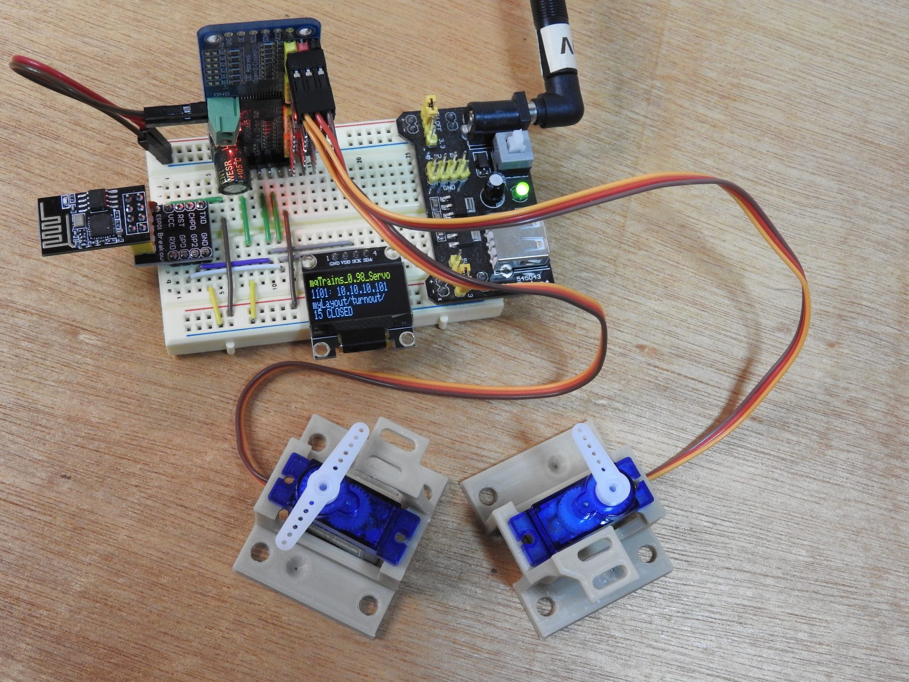

 

# mqTrains

*Model railroad electronics using* ***MQTT*** *.*

 
 

[![Button Website]][Website]   
[![Button Download]][Download]   
[![Button Documentation]][Documentation]

[![Button Requirements]][Requirements]   
[![Button Uploading]][Uploading]

 
 

 

<!----------------------------------------------------------------------------->

[Website]: https://www.mqtrains.com/

[Documentation]: released/mqTrains-UserReference.pdf
[Requirements]: docs/Requirements.md
[Uploading]: docs/Uploading.md
[Download]: preReleased/IOMCP/mqTrains_IO_0.77_1MB.bin

<!---------------------------------[ Buttons ]--------------------------------->

[Button Documentation]: https://img.shields.io/badge/Documentation-008FC7?style=for-the-badge&logoColor=white&logo=GitBook
[Button Requirements]: https://img.shields.io/badge/Requirements-167C80?style=for-the-badge&logoColor=white&logo=pnpm
[Button Uploading]: https://img.shields.io/badge/Uploading-CC6699?style=for-the-badge&logoColor=white&logo=RSS
[Button Download]: https://img.shields.io/badge/Download-C9284D?style=for-the-badge&logoColor=white&logo=DocuSign
[Button Website]: https://img.shields.io/badge/Website-569A31?style=for-the-badge&logoColor=white&logo=GoogleChrome
